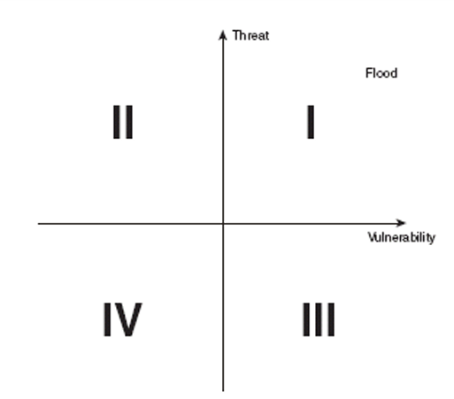

> 授課老師：林韓禹

<!-- [CH05 The Business of Security](#ch05-the-business-of-security)
* [Business Continuity Planning (BCP)](#business-continuity-planning-bcp)
* [Implementing Controls](#implementing-controls)
* [Maintaining the Plan](#maintaining-the-plan)
* [Disaster Recovery Planning](#disaster-recovery-planning)
* [Selecting the Team](#selecting-the-team)
* [Building the Plan](#building-the-plan)
* [Disaster Recover Facilities](#disaster-recover-facilities)
* [Creative Disaster Recovery](#creative-disaster-recovery)
* [Training](#training)
* [Testing](#testing)
* [Implementing The Plan](#implementing-the-plan)
* [Maintaining the Plan](#maintaining-the-plan)
* [Data Classification](#data-classification)
* [Security Clearances](#security-clearances)

# CH04 General Security Principles 
and Practices

## Common Security Principles
* Separation of Privileges Principle 分散權力原則
    * 不能讓一個人擁有造成危機的權利
* Least Privilege Principle 最小權力原則
    * 一個個體只能有達到目標的最小控制權
    * 常見違反狀況來自管理員的疏失 (administrator inattention)
    * 還有另一種常見狀況是權限蔓延 (privilege creep)
* Defense in Depth Principle 縱深防禦原則
    * 用分層方式防護
    * 從入口點開始防禦，接著集中防禦在bottleneck points
* Security through Obscurity 模糊式防禦
    * 早期基於保密來鞏固安全性
    * 已不再這麼有效，因為很多資訊變得容易取得

# CH05 The Business of Security

## Business Continuity Planning (BCP)
* Risk = Threat * Vulnerability (風險 = 威脅 * 漏洞)
* A quadrant map is a good tool for vulnerability assessment. 
    * 象限圖是用來做風險評估的好工具
    * Example

## Implementing Controls
* 有四種方式
    * Risk Avoidance 避免
    * Risk Mitigation 降低
    * Risk Acceptance 接受
    * Risk Transference 轉移
* BCP 團隊要決定這些策略該如何應用

## Maintaining the Plan
* BCP 是一份真實存在的文件
* 環境、業務、現有技術的改變都會引發新的風險
* BCP 要能夠應對這些改變
* 所以 BCP 要定期檢查和更新

## Disaster Recovery Planning
* 遇到危機時，保障組織的運作
* 是一份恢復計畫的文件
* 目標
    * 必要時用備用設施繼續運作
    * 使用備用設施提供額外操作
    * 要先做準備，當主要設備可以運作時，該如何轉移回去

## Selecting the Team
* 確保計畫有包括組織內的重要部門和任務
* 團隊的規模取決於組織大小
* 比較大的組織，計畫和實作的團隊可以分開來
* DRP 任務是次要的，團隊成員平常還是以原本的工作為主

## Building the Plan
* 計畫必須要詳細說明
    * 每個人的職責
    * 所需要的資源 (包含金援、人力、硬體、軟體)
* 主要困難點為選擇備用設施
    * 能力越好的越貴

## Disaster Recover Facilities
* Hot site
    * 包含硬體、軟體、需要的資料
    * 要能立即接管
* Warm site
    * 包含大多數的硬體、軟體，不會即時維護資料副本
    * 要能在幾小時或幾天內接管
* Cold site
    * 包含基本的電力、通訊、支援系統
    * 沒有硬體、軟體、資料。
    * 要能在幾周或幾個月內接管

## Creative Disaster Recovery
* 有些組織可能適合用非傳統DRP
* 地理上分散的組織可能需要移動的設施
    * Ex: 拖車、移動房屋、航空運輸裝置
    * 不能將他們都放在同個地方
* Mutual assistance agreements
    * 和其他組織分攤成本
    * 要小心維護機密資料

## Training
* Initial training
    * 當人員進來之後就會做全面的培訓
* Refresher training
    * 定期訓練，以更新團隊的技術和應變準備
* 訓練的時長、頻率、規模都要根據每個人的職責客製化

## Testing
* Checklist review
    * 最簡單、最不費力的方式
    * 每個人都有一個checklist
    * 測試期間每個人都要去檢查自己的checklist
    * 可以團隊或單人完成
* Tabletop exercise
    * 測試員描述特定的災難情境
    * DRP 成員口頭演練他們在該情境的回應
    * 情境可以在測試時或提前告知
* Soft test (Parallel test)
    * DRP 成員會被告知一個災難情境，然後需要啟動恢復設施來回應
    * 恢復設施和主要設施要同時運作，不用全部運作
    * 更全面的測試，同時也是更貴的測試
* Hard test (Full-interruption test)
    * 在很罕見的任務危急情況下使用，破壞性太強太貴
    * 涉及完全轉移到備用設施，再轉回主要設施

## Implementing The Plan
* 計畫需要定義第一時間向誰回報
    * 當目睹了一個可能需要 Disaster recovery 的事件，所有員工都必須知道自己該做什麼
* 宣布災難情況的授權必須要小心分配
    * 可以不只一個人

## Maintaining the Plan
* 團隊成員、程序、工具都要與時俱進
* 團隊應該要嚴格按照 Checklist 以避免恐慌和混亂
    * Checklist 也要保持最新版本
* DRP 要利用學到的經驗彙報，持續測試和評估

## Data Classification
* 提供使用者分層敏感訊息的方式
* 提供每個級別合適保障系統
* 獲取機密資料的前提條件
    * Security clearance 安全許可
    * Need to know 知情必要性
* 政府和私人企業有相似的分類系統

## Security Clearances -->

# 名詞解釋

## CH04
* privilege creep 權力蔓延
* Obscurity 朦朧
* Mandatory 強制的
* Evaluations 評價
* Perimeter protection 周遭的防禦
* Electronic Emanations 電子放射

## CH05
* quadrant map 象限圖
* assessment 評估
* quantitative 定量的
* qualitative 定性的
* mitigation 降低
* disperse 分散
* labor-intensive 勞力密集
* verbally 口頭地
* debriefings 彙報
* rigorous 嚴格的

## CH06
* Cryptology 密碼學
* Cryptography 加密
* Cryptanalysis 解密
* Crypto 以上全部(還有包含更多)
* symmetric 對稱
* Kerckhoffs Principle
    * 攻擊者知道整個系統
    * 只有密鑰是秘密
* Confidentiality 機密性
* Integrity 完整性
* digest 摘要
* asymmetric 非對稱
* Nonrepudiation 不可否認性
* obscurity 朦朧
* rigorously 嚴格地
* PGP, Pretty Good Privacy
* Implicit 隱性

# Reference
* 老師上課用的簡報
* [1062 資安筆記 (By PenutChen) ](https://hackmd.io/@PenutChen/rJ85P4MCN)