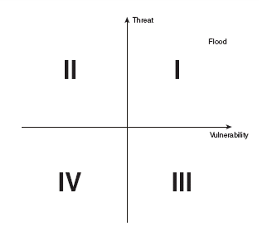

> 授課老師：林韓禹 Han-Yu Lin

## CH05 The Business of Security

### Business Continuity Planning (BCP)
* Risk = Threat * Vulnerability (風險 = 威脅 * 漏洞)
* A quadrant map is a good tool for vulnerability assessment. 
    * 象限圖是用來做風險評估的好工具
    * Example

### Implementing Controls
* 有四種方式
    * Risk Avoidance 避免
    * Risk Mitigation 降低
    * Risk Acceptance 接受
    * Risk Transference 轉移
* BCP 團隊要決定這些策略該如何應用

### Maintaining the Plan
* BCP 是一份真實存在的文件
* 環境、業務、現有技術的改變都會引發新的風險
* BCP 要能夠應對這些改變
* 所以 BCP 要定期檢查和更新

### Disaster Recovery Planning
* 遇到危機時，保障組織的運作
* 是一份恢復計畫的文件
* 目標
    * 必要時用備用設施繼續運作
    * 使用備用設施提供額外操作
    * 要先做準備，當主要設備可以運作時，該如何轉移回去

### Selecting the Team
* 確保計畫有包括組織內的重要部門和任務
* 團隊的規模取決於組織大小
* 比較大的組織，計畫和實作的團隊可以分開來
* DRP 任務是次要的，團隊成員平常還是以原本的工作為主

### Building the Plan
* 計畫必須要詳細說明
    * 每個人的職責
    * 所需要的資源 (包含金援、人力、硬體、軟體)
* 主要困難點為選擇備用設施
    * 能力越好的越貴

### Disaster Recover Facilities
* Hot site
    * 包含硬體、軟體、需要的資料
    * 要能立即接管
* Warm site
    * 包含大多數的硬體、軟體，不會即時維護資料副本
    * 要能在幾小時或幾天內接管
* Cold site
    * 包含基本的電力、通訊、支援系統
    * 沒有硬體、軟體、資料。
    * 要能在幾周或幾個月內接管

### Creative Disaster Recovery
* 有些組織可能適合用非傳統DRP
* 地理上分散的組織可能需要移動的設施
    * Ex: 拖車、移動房屋、航空運輸裝置
    * 不能將他們都放在同個地方
* Mutual assistance agreements
    * 和其他組織分攤成本
    * 要小心維護機密資料

### Training
* Initial training
    * 當人員進來之後就會做全面的培訓
* Refresher training
    * 定期訓練，以更新團隊的技術和應變準備
* 訓練的時長、頻率、規模都要根據每個人的職責客製化

### Testing
* Checklist review
    * 最簡單、最不費力的方式
    * 每個人都有一個checklist
    * 測試期間每個人都要去檢查自己的checklist
    * 可以團隊或單人完成
* Tabletop exercise
    * 測試員描述特定的災難情境
    * DRP 成員口頭演練他們在該情境的回應
    * 情境可以在測試時或提前告知
* Soft test (Parallel test)
    * DRP 成員會被告知一個災難情境，

### 單字筆記
* quadrant map 象限圖
* assessment 評估
* quantitative 定量的
* qualitative 定性的
* mitigation 降低
* disperse 分散
* labor-intensive 勞力密集
* verbally 口頭地

### Reference
* 老師上課用的簡報
* [1062 資安筆記 (By 
PenutChen) ](https://hackmd.io/@PenutChen/rJ85P4MCN)