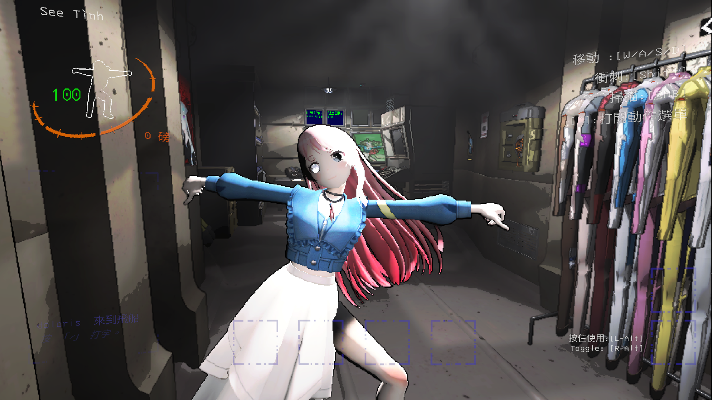

# 前言

[MyGO Model Mod](https://thunderstore.io/c/lethal-company/p/YuYutw123/MyGO_Together/)

最近推朋友玩了Lethal Company，所以又開始玩Lethal Company，然後裝了一堆自定義Model模組（像是Hololive, Valorant），結果居然沒有MyGO模型的模組，所以我決定弄一個來玩 :)

然後發現我根本不會Unity和C#，ㄏㄏ

**這篇文章會偏向我製作的過程紀錄**

# 事前準備
* 3D Model
* Unity 2022.3.9f1(建議版本)
* Visual Studio 2022

