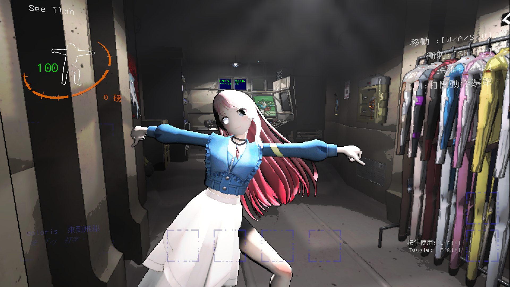

# 前言

[MyGO Model Mod](https://thunderstore.io/c/lethal-company/p/YuYutw123/MyGO_Together/)

最近推朋友玩了Lethal Company，所以又開始玩Lethal Company，然後裝了一堆自定義Model模組（像是Hololive, Valorant），結果居然沒有MyGO模型的模組，所以我決定弄一個來玩 :)

然後發現我根本不會Unity和C#，ㄏㄏ

**這篇文章會偏向我製作的過程紀錄**

# 事前準備
* 3D Model
* Unity 2022.3.9f1(建議版本)
* Visual Studio 2022
* Git

# Unity 模型處理
## PMX 轉 FBX
[MyGO模型](https://www.deviantart.com/bunglescrungle/art/BanG-Dream-MyGO-FBX-and-PMX-DL-1036304336)

因為我找到的MyGO模型只有PMX檔是全身，FBX檔的頭和身體是兩個檔案，我不會Blender不會合檔案，所以要把PMX轉成FBX
### 使用 MMD4Mecanim 轉檔
[載點](https://stereoarts.jp/MMD4Mecanim_Beta_20200105.zip)
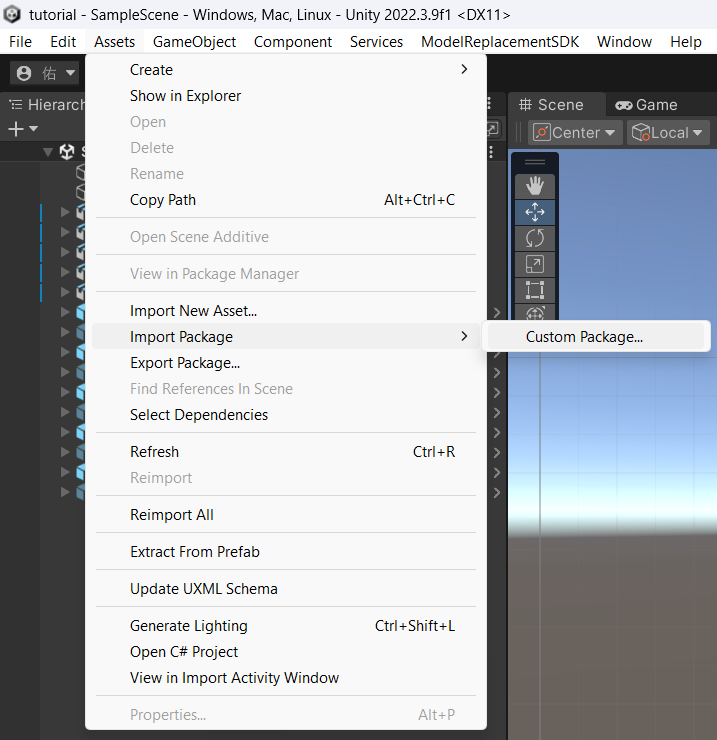
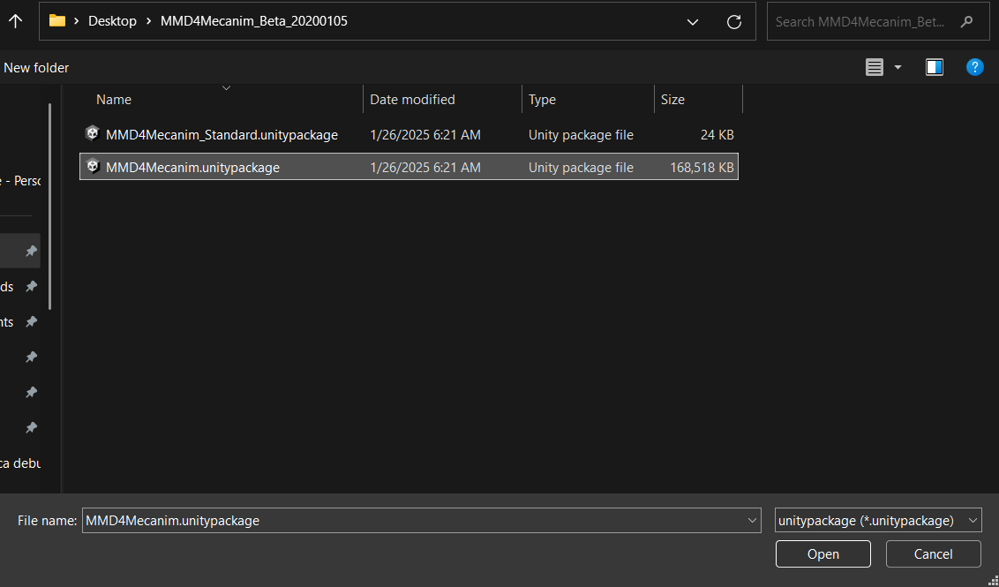
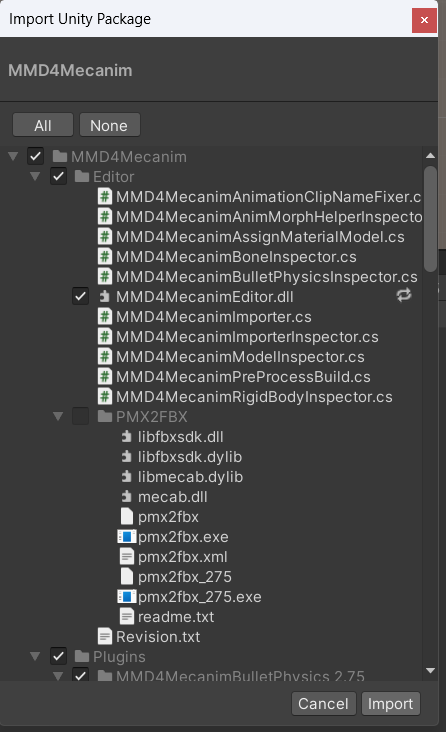

**跑完之後點擊你的Model資料夾中的MMD4檔，同意**
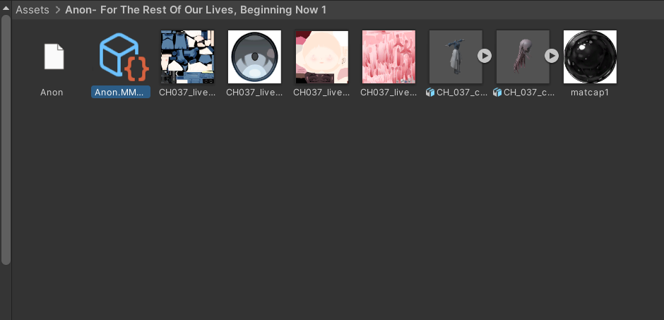
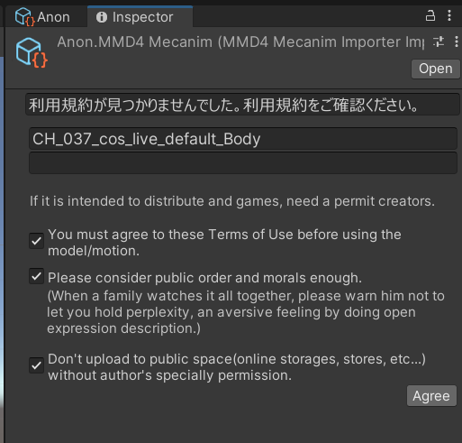

**然後就會生成FBX檔了**
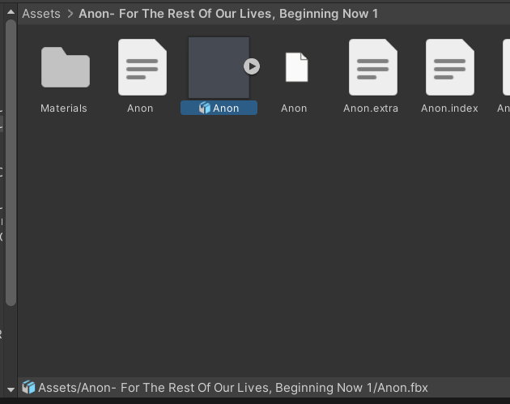

## 設定模型

### 基本設定
點擊你的FBX檔，右邊會跳出 Inspector<br>
設定 **Humanoid**、**Create From This Model**<br>
點 **Apply**
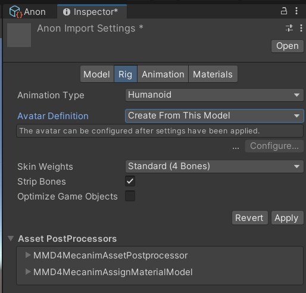

跑完後，點擊Configure，檢查你的骨架有沒有正確<br>
然後姿勢要呈**T字形** <br>

弄好就按 **Apply**
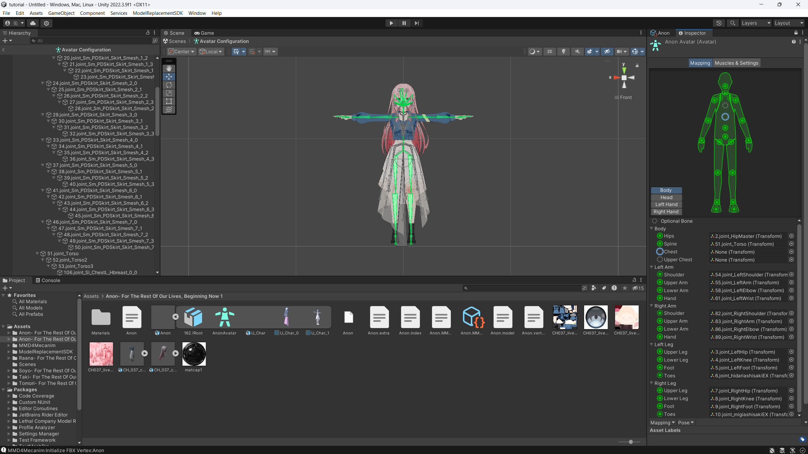
像這邊 Chest 骨架沒有對應到
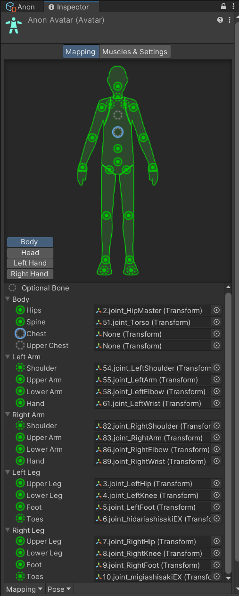

### Model Replacement SDK 設定
* 安裝 Model Replacement SDK
    * Window -> Package Manager
    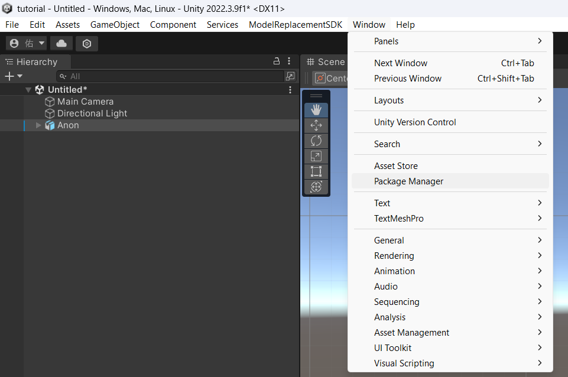
    * Add package from git URL 
        * 貼上這個 [連結](https://github.com/BunyaPineTree/LethalCompany_ModelReplacementSDK.git#upm)，點 **Add**
    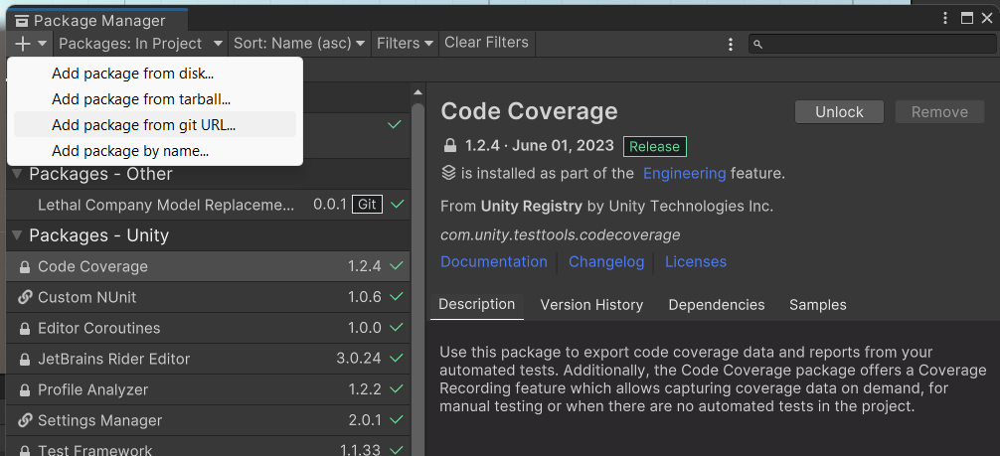
* 套用到你的模型
    * 設面步驟設定完後，把你的 Model 丟進去場景<br>
    選取你的 Model，然後在 ModelReplacementSDK 中選擇 **Setup Model**<br>
    弄完就會生出兩個物件
    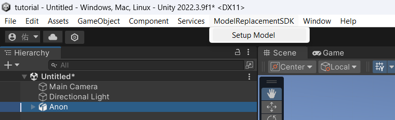
    

    * 把你的模型放到正確位置，那個圓形是基準面
    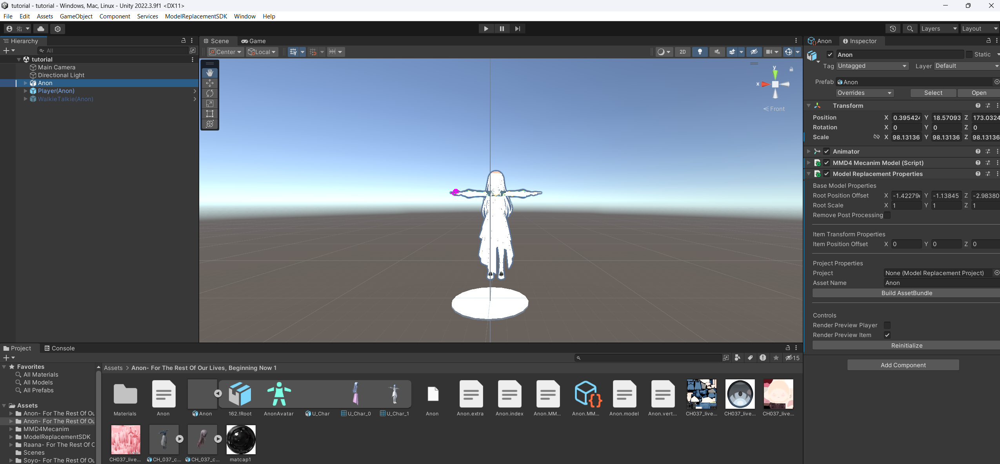
    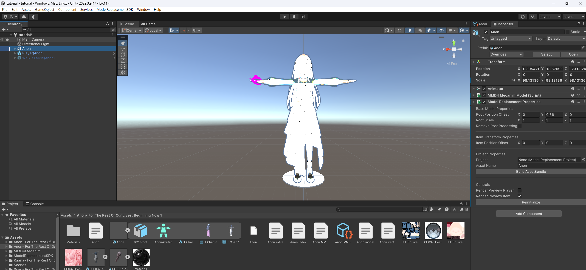

    * 然後把每個骨頭加上 **Rotation Offset**
    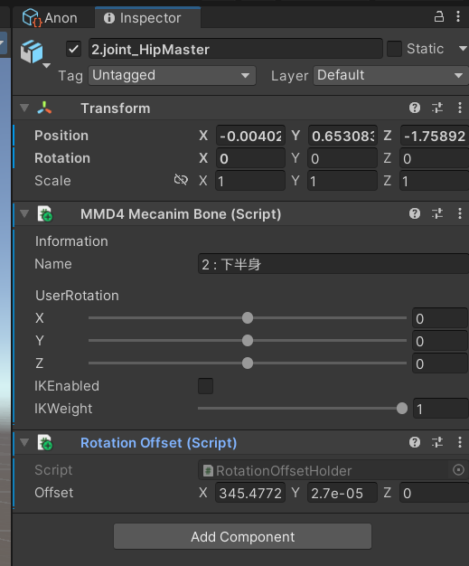

## 設定 Project
* 在 Assets 空白處點右鍵，選 Create -> ModelReplacemectSDK -> Create Project
    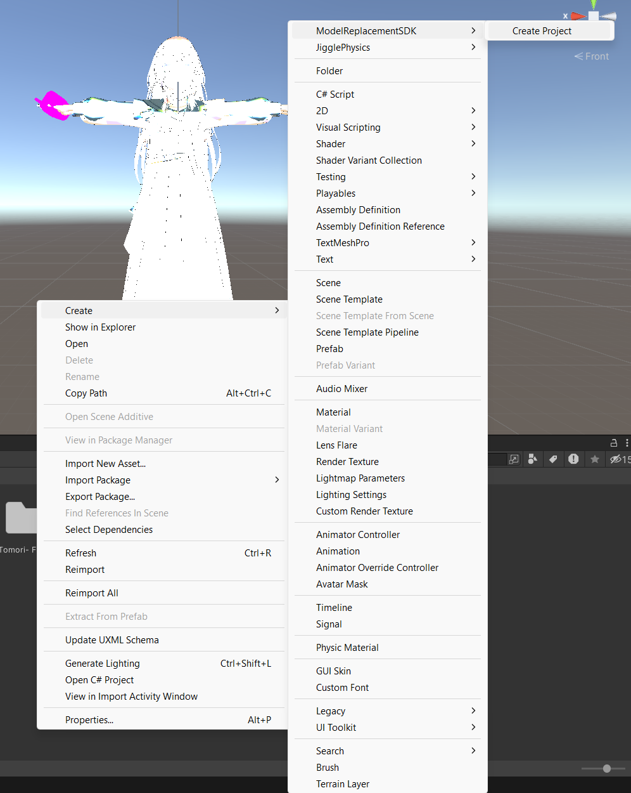
* 接下來把所有你要用的 Model 都綁到 Project
    * 在 Model 的 Inspector 中<br>
    Model Replacement Properties -> Project Properties -> Project<br>
    選擇你剛剛創建的 Project
    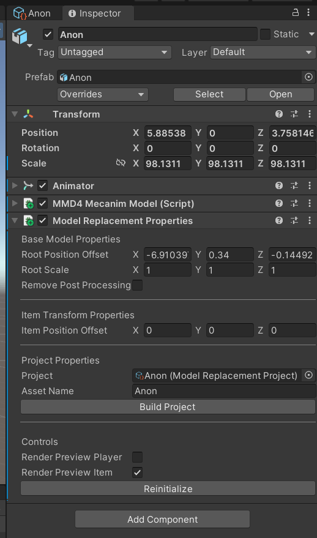
* 綁完後到 Project 物件中，點擊 **Build Project**
    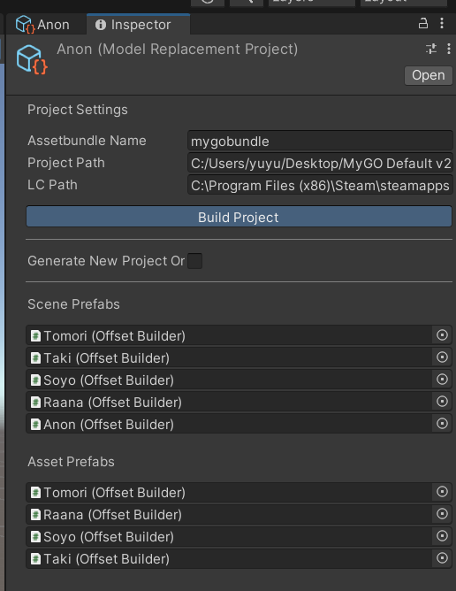
## 檔案生成
* 上面步驟都完成後就會生成模組所需要的 Model 資源了
    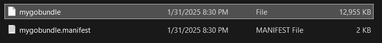

# 寫模組時間
## Visual Studio 專案
* 創建專案，選 **Class Library (.NET Framework)**<br>
    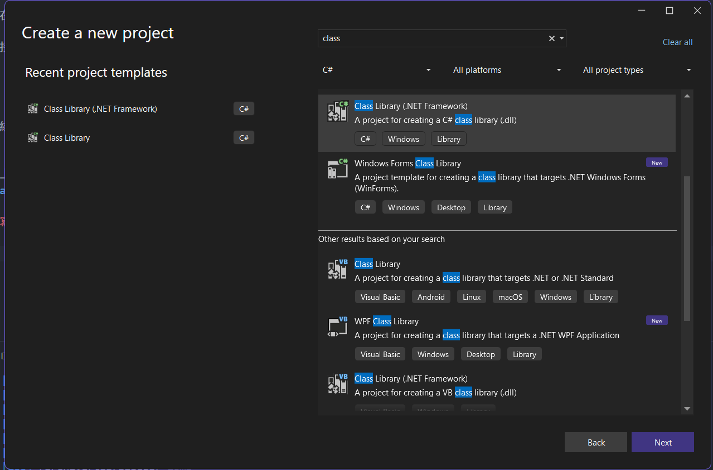
* 添加專案需要的 Reference<br>
    對專案名稱點右鍵，Add -> Reference...<br>
    詳細添加操作請參考[這個影片](https://youtu.be/4Q7Zp5K2ywI?si=ABXuQr-U05u5-irQ&t=378)<br>
    **以下是我用到的Reference**
    * [BepInEx](https://github.com/BepInEx/BepInEx/releases/tag/v5.4.23.2)
    * [More Suits](https://thunderstore.io/c/lethal-company/p/x753/More_Suits/source/)
    * [ModelReplacementAPI](https://github.com/BunyaPineTree/LethalCompany_ModelReplacementAPI/releases/tag/Release_v2.4.5)
    * 剩下的應該可以在`C:\Steam\steamapps\common\Lethal Company\Lethal Company_Data\Managed`找到
    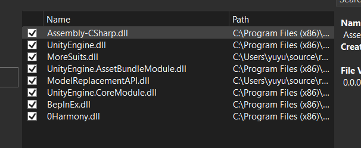
* 專案結構長這樣，詳細程式碼可以到我的 [Github Repo](https://github.com/YuYutw123/MyGO-Together) 看，照樣造句改就好了<br>
    ModelReplacementAPI.dll 則在[這邊](https://github.com/BunyaPineTree/LethalCompany_ModelReplacementAPI/releases/tag/Release_v2.4.5)下載
    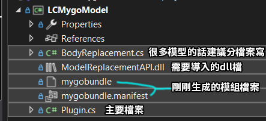
## 導出 dll 檔
* 寫完 code 後，先點選你的 bundle 檔案
    在下面 Advanced 的 Build Action 中選擇 **Embedded Resource**<br>
    這樣你的模組檔案才會嵌入到 dll 檔裡面
    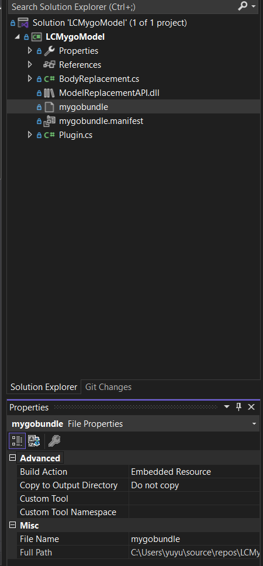
* 設定完後，點 **Build**<br>
    然後到指定的地方找到你的 dll 檔
    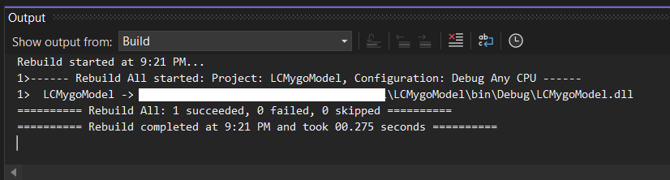

# 設定 Thunderstore Mod package
結構如下，可[參考](https://github.com/YuYutw123/MyGO-Together/tree/master/Builds)
```
BepInEx
└── plugins
    └── moresuits
        ├── advanced
        │   ├── Model_1.json
        │   └──Model_2.json
        ├── !less-suits.txt
        ├── Model_1.png
        ├── Model_2.png
        └── LCMygoModel.dll
├── icon.png
├── manifest.json
├── manifest.zip
└── README.md

```
# Reference
* [Bushiroad](https://bushiroad.com/)
* [Hololive Company](https://thunderstore.io/c/lethal-company/p/Tacocat12/Hololive_Company/)
* [x753 / Lethal-Company-More-Suits](https://github.com/x753/Lethal-Company-More-Suits)
* [如何在Unity中导入pmx格式的MMD模型_哔哩哔哩_bilibili](https://www.bilibili.com/video/BV1Mq4y187pT/?vd_source=f5639cb686b57c8db469894627c7dae5)
* [BunyaPineTree / LethalCompany_ModelReplacementAPI](https://github.com/BunyaPineTree/LethalCompany_ModelReplacementAPI)
* [BanG Dream MyGO!!! FBX and PMX DL By BungleScrungle](https://www.deviantart.com/bunglescrungle/art/BanG-Dream-MyGO-FBX-and-PMX-DL-1036304336)
* [How to Import a Model into Lethal Company By DoughnutSamurai](https://www.youtube.com/watch?v=sveHcIAG1mA&ab_channel=DoughnutSamurai)
* [Lethal Company - How to write your own mod from scratch! By MrMiinxx](https://www.youtube.com/watch?v=4Q7Zp5K2ywI&t=378s&ab_channel=MrMiinxx)
