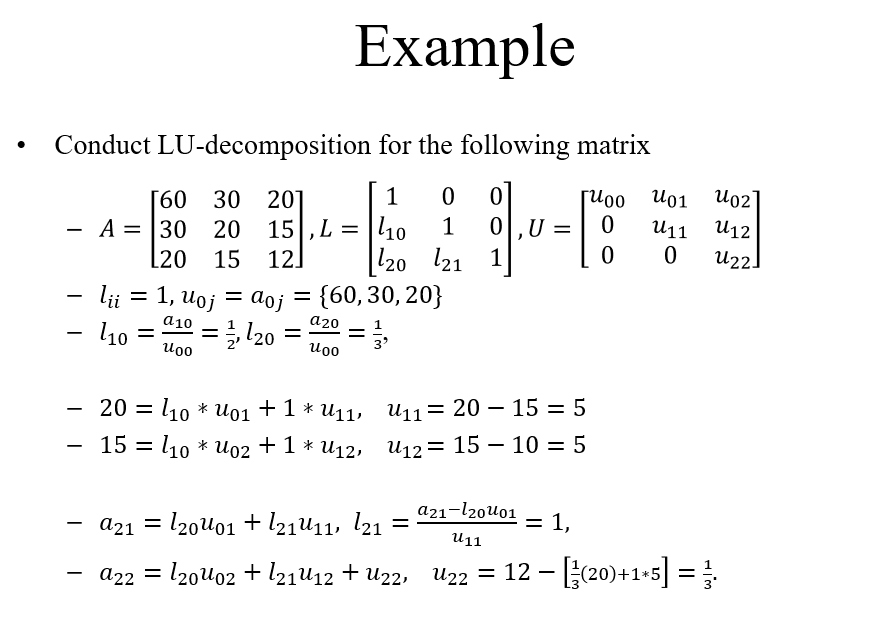

> 授課老師：翁世光

# LU 分解
## Doolittle’s Method
- [LU 分解](#lu-分解)
  - [Doolittle’s Method](#doolittles-method)
    - [Introduction, triangular systems](#introduction-triangular-systems)
    - [Doolittle’s method](#doolittles-method-1)
    - [Time complexity](#time-complexity)
    - [Error analysis](#error-analysis)
- [Reference](#reference)

### Introduction, triangular systems
* LU 分解: 給一個線性系統，把他的係數矩陣，分解成**上三角**和**下三角**矩陣
    * $A=L*U$
* 分解之後我們就可以解出原系統
    * 我們有 $Ax=b$ 和 $A=L*U$
    * 已知，A、b、L、U，要解出 x
    * $Ax=b$ 等同於 $LUx=b$
    * 令 $y=Ux$，則 $Ly=b$
    * 解 $Ly=b$ 得到 y，再用 $Ux=y$ 解出 x
* 為什麼要做LU分解?
    * 在一些系統中，係數矩陣A不變，但向量b會隨著時間作變化
    * 所以用高精度的方法把A分解成LU，然後用forward和backward substitutions解決系統
    * 優點：更低的時間複雜度、更低的誤差
* LU分解不是唯一的
    * 可逆矩陣A可以被分解成不同的L和U
    * 如果定義L為特定矩陣，則A的LU分解為唯一的
    * Doolittle’s method就是定義對角線元素全為1
### Doolittle’s method

### Time complexity
### Error analysis

# Reference
* 老師的簡報