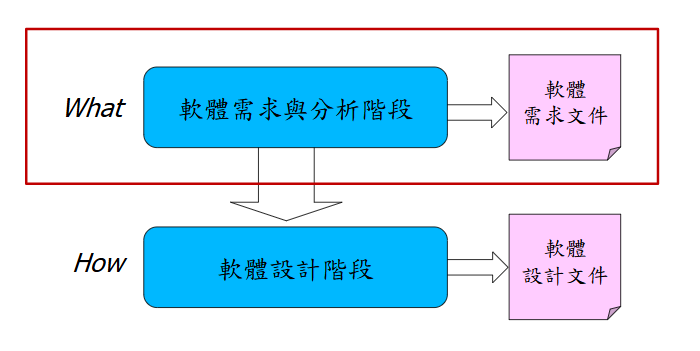

> 授課老師：馬尚彬

# 基礎需求工程

## 需求的種類

||使用者需求|系統需求|
|---|---|----|
|功能需求|功能性使用者需求|功能性系統需求|
|非功能需求|非功能性使用者需求|非功能性系統需求|

## 使用者需求與系統需求
* 使用者需求：相對抽象的想法、企業目的為導向、以口語陳述為主
* 系統需求：較明確、系統導向的思考與分析、以文字規格呈現
    * 通常以軟體需求規格書的方式呈現，作為雙方建立合約的基礎

## 功能需求與非功能需求
* 功能需求 Functional Requirements
    * 系統應提供的服務陳述(**statements of services**)，以描述系統應如何對**特定輸入**做出反應，以及系統應如何在特定情況下運行
    * 可以說明**系統不應該做什麼**
* 非功能需求 Non-Functional Requirements 
    * 對系統提供的服務或功能的約束(constraint)，應採用的標準規格、開發流程約束、回應時間約束等
    * 通常運用於整個系統而不是單個功能或服務
## 功能性使用者/系統需求
* 功能性使用者需求
    * 功能性使用者需求是系統應該做什麼的高階陳述(high-level statements)
* 功能性系統需求
    * 功能性系統需求則需要詳細描述系統服務，從系統角度去分析有哪些功能需提供

# Reference
* 老師的簡報